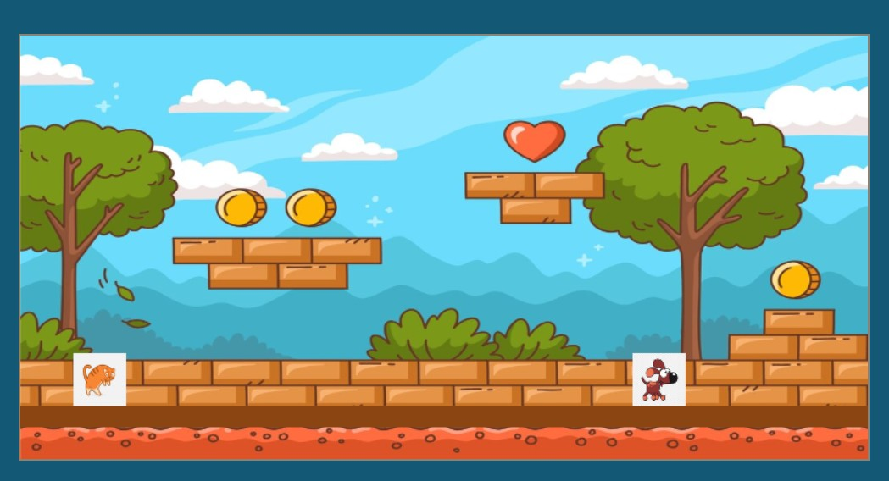
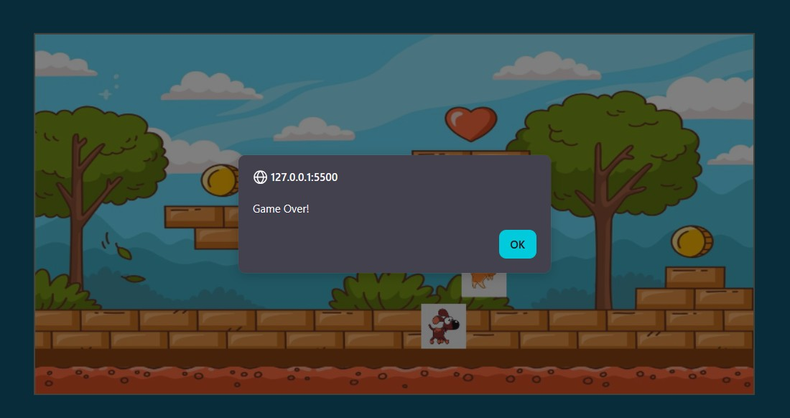

# Vanilla JS Platformer

A small vanilla JavaScript canvas platformer built as an evening practice project.  
Demonstrates ES modules, basic physics, collision handling, asset loading, and a simple game loop.

## Features

- Canvas-based rendering
- Modular structure (ES modules)
- Basic gravity and jump physics
- Collision detection (platforms and enemies)
- Simple enemy movement logic
- Keyboard controls (arrow keys)
- Sound effects and background music
- Game loop via `requestAnimationFrame`

## Screenshots

  


## Run locally

```bash
npm install
npm start

Then open the local server URL (e.g. http://localhost:3000
).

Controls
ArrowUp — jump
ArrowLeft / ArrowRight — move
Limitations
No level system or progression
No state management (restart, menu, scoring)
Simplified collision model
Hardcoded assets and parameters
No build step or optimization
Tech
JavaScript (ES modules)
HTML5 Canvas
CSS

## Notes

- Runs in the browser using native ES modules (no bundler)
- Local server required due to module loading (CORS restrictions)
- Project created as a focused practice of modular JS structure and basic game mechanics